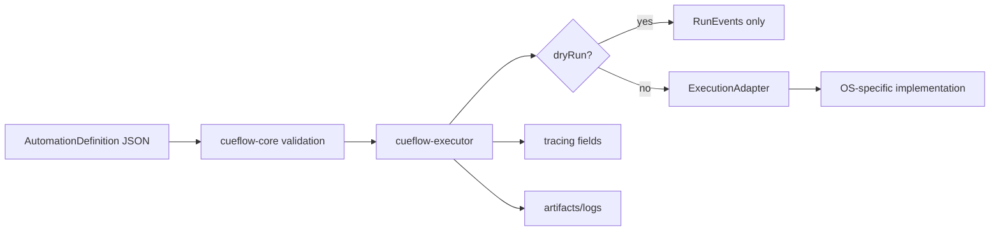

# Cueflow architecture

Cueflow is layered so portable workflow definitions remain independent from platform execution details.

## Layers

1. `cueflow-core`
   - Defines the portable automation DSL.
   - Validates identifiers, schema version, duplicate steps, retry/timeout sanity, and target shape.
   - Exposes generated JSON Schema and a single parse/version-validation boundary for persisted definitions.
   - Rejects unsupported schema versions explicitly until a migration is implemented.
   - Owns run events, run errors, artifacts, run configuration, and portability analysis.

2. `cueflow-executor`
   - Validates a definition before running it.
   - Emits `started`, `stepStarted`, `stepSucceeded`, `stepFailed`, and `completed` events.
   - Uses `RunControl` for cooperative cancellation and pause/resume, and always emits a single terminal outcome.
   - Uses `RunEventSink` to stream the same event sequence retained in the final run report.
   - Uses an injectable `ExecutionClock` for testable retry backoff and post-call timeout accounting.
   - Resolves explicit platform overrides before invoking an adapter.
   - Runs adapter-provided preflight diagnostics before any execution side effect; error-severity diagnostics block the run.
   - Polls adapter-backed wait conditions and maps failed assertions to structured run errors.
   - Stops on failure by default, emits `manualIntervention` for `prompt`, and only continues when explicitly configured.
   - Skips platform calls when `RunConfig.dryRun` is true.
   - Preserves adapter diagnostics in structured run errors so hosts can surface selector candidates and failure context.
   - Adds `tracing` fields apps can map into observability tools.

3. `cueflow-adapters`
   - Defines the platform boundary for launch, focus, input, window, process, and read-only accessibility inspection operations.
   - Ships a Windows-first module behind `cfg(windows)` for native shell launch, exact-title window focus/query, `SendInput` text/key/scroll injection, targeted UI Automation key focus/readiness checks, bounded path-bearing UI Automation tree capture, selector candidate generation, screenshot capture, last-resort absolute coordinate clicks, and file existence checks.
   - Rejects unsupported selector shapes and UI Automation-dependent actions during preflight instead of silently ignoring constraints.
   - Retains no-op/non-Windows adapters while macOS and Linux implementations are added behind the same portable contract.

4. `cueflow-recorder`
   - Represents optional capture/authoring.
   - Recording should consolidate input and screen events into the same `AutomationDefinition` DSL.
   - It should not introduce a separate macro replay format.

5. `cueflow-tauri`
   - Represents a thin app bridge for frontend editors that submit run requests.
   - Frontend apps should edit definitions and request runs; they should not execute automations directly.

## Execution flow

## Portability rules

- Semantic actions are the happy path.
- Platform overrides are explicit and local to steps or targets.
- Windows, macOS, and Linux behavior belongs below the portable schema.
- Coordinates are allowed as a last-resort target, not a default modeling strategy; Windows interprets them as absolute screen coordinates.
- Accessibility tree inspection is read-only, bounded by depth and node count, omits element values by default, and should feed authoring/agent planning rather than become an opaque replay artifact. Accessibility node paths can be reused as stable-enough selectors when names or automation ids are absent, but selectors still fail closed on no-match, ambiguity, disabled/offscreen targets, focus denial, or truncated semantic search.
- Host policy controls gate fragile or sensitive behavior. Coordinate targets, path-only selectors, and runtime value reads require explicit run approval. Read-only accessibility inspection has a separate `--include-values` opt-in for controlled surfaces.
- Accessibility paths are generated from Windows UI Automation child indexes. `[]` targets the resolved window root; non-empty paths target descendants and should be paired with semantic facts such as control type whenever possible.
- Output video, screenshots, accessibility trees, and logs are artifacts, not the automation definition itself.
