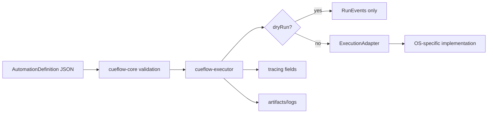

# Cueflow architecture

Cueflow is layered so portable workflow definitions remain independent from platform execution details.

## Layers

1. `cueflow-core`
   - Defines the portable automation DSL.
   - Validates identifiers, schema version, duplicate steps, retry/timeout sanity, and target shape.
   - Exposes generated JSON Schema and a single parse/version-validation boundary for persisted definitions.
   - Rejects unsupported schema versions explicitly until a migration is implemented.
   - Owns run events, run errors, artifacts, run configuration, and portability analysis.

2. `cueflow-executor`
   - Validates a definition before running it.
   - Emits `started`, `stepStarted`, `stepSucceeded`, `stepFailed`, and `completed` events.
   - Uses `RunControl` for cooperative cancellation and pause/resume, and always emits a single terminal outcome.
   - Uses `RunEventSink` to stream the same event sequence retained in the final run report.
   - Uses an injectable `ExecutionClock` for testable retry backoff and post-call timeout accounting.
   - Resolves explicit platform overrides before invoking an adapter.
   - Stops on failure by default, emits `manualIntervention` for `prompt`, and only continues when explicitly configured.
   - Skips platform calls when `RunConfig.dryRun` is true.
   - Adds `tracing` fields apps can map into observability tools.

3. `cueflow-adapters`
   - Defines the platform boundary for launch, focus, input, window, and process operations through the executor adapter trait.
   - Starts with no-op and unsupported current-platform adapters.
   - Real platform modules should live behind `cfg` boundaries.

4. `cueflow-recorder`
   - Represents optional capture/authoring.
   - Recording should consolidate input and screen events into the same `AutomationDefinition` DSL.
   - It should not introduce a separate macro replay format.

5. `cueflow-tauri`
   - Represents a thin app bridge for frontend editors that submit run requests.
   - Frontend apps should edit definitions and request runs; they should not execute automations directly.

## Execution flow

## Portability rules

- Semantic actions are the happy path.
- Platform overrides are explicit and local to steps or targets.
- Windows, macOS, and Linux behavior belongs below the portable schema.
- Coordinates are allowed as a last-resort target, not a default modeling strategy.
- Output video, screenshots, and logs are artifacts, not the automation definition itself.
